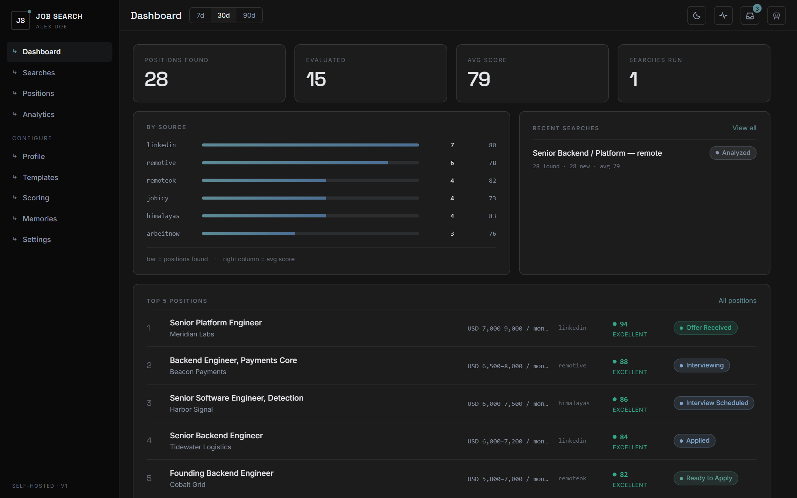
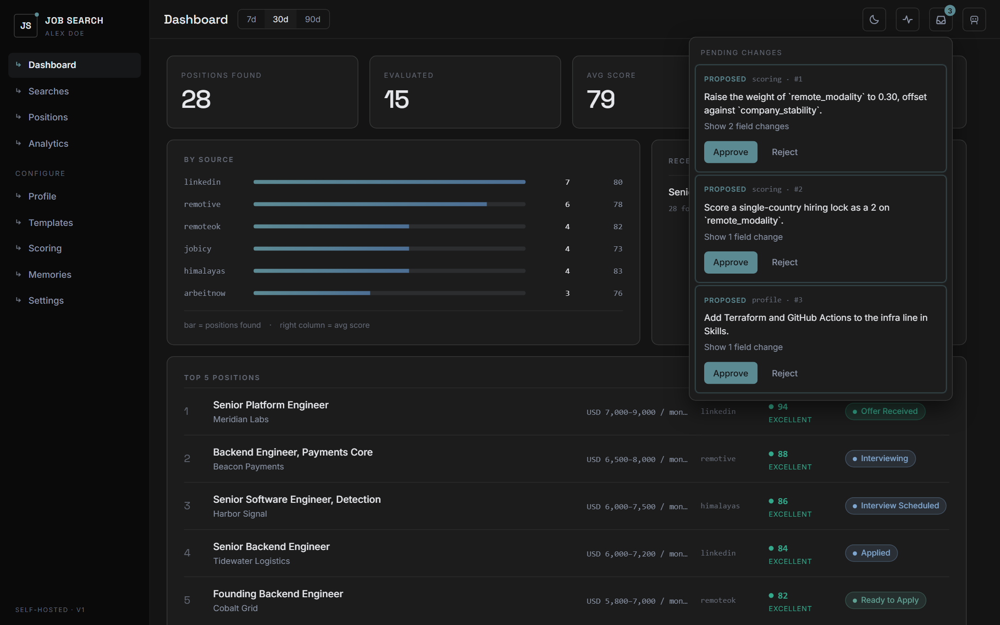
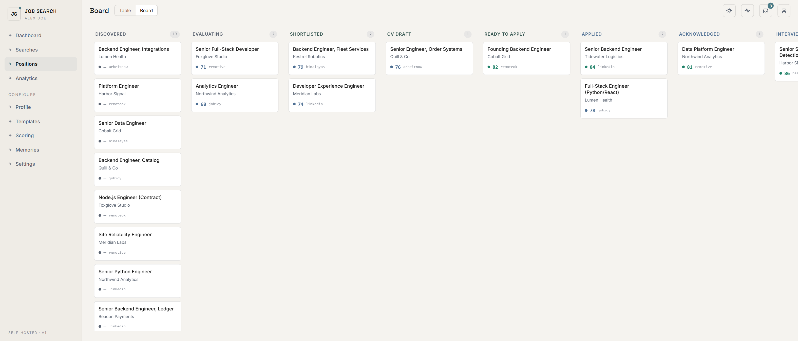
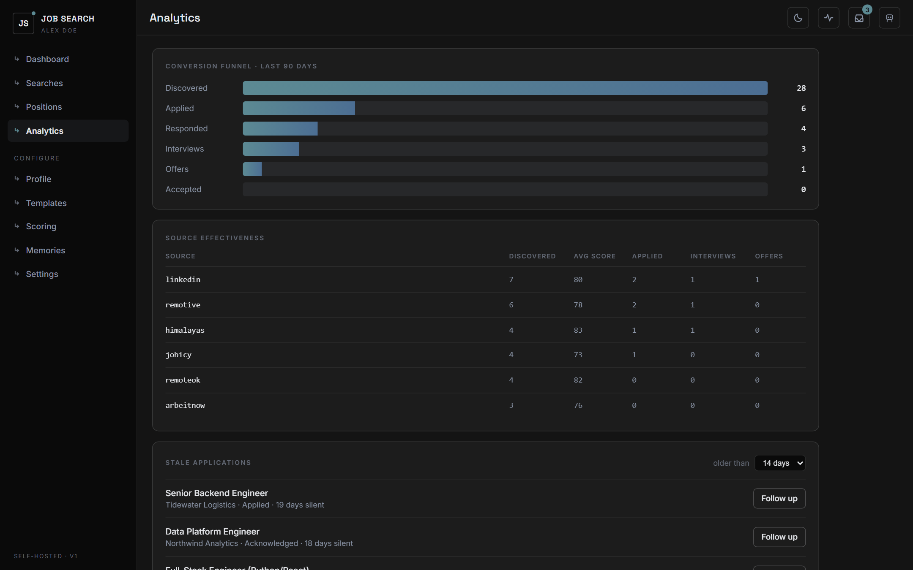
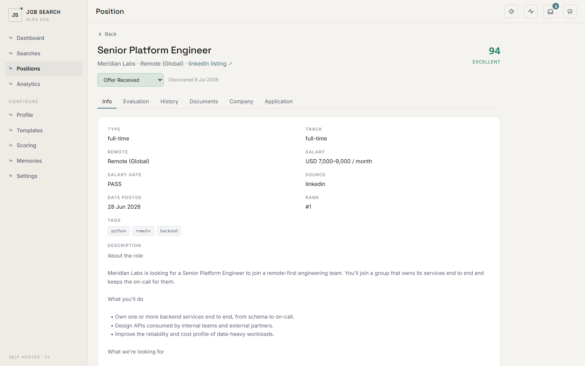
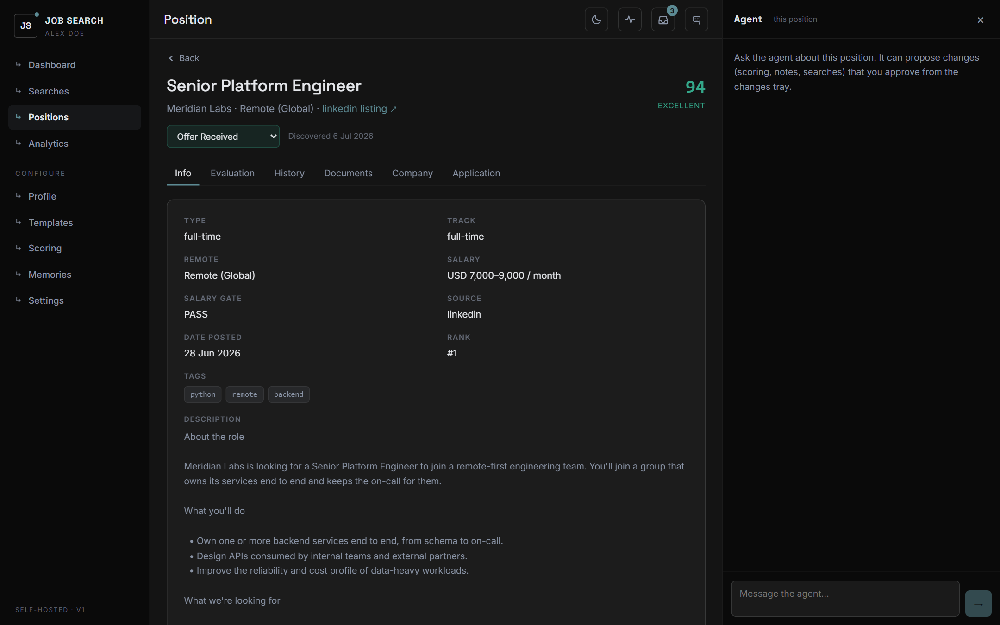

# Job Search Platform

[](https://github.com/juanbecaceci/job-search-platform/actions/workflows/ci.yml)
[](LICENSE)

A **self-hosted job search platform** where the reasoning runs on your own agent
CLI subscription. It discovers jobs across seven sources, scores them against
your profile, drafts a tailored CV and cover letter per position, and tracks a
15-state application pipeline. No API keys, no hosted backend, no shared data —
everything runs on your machine, against a SQLite file you own.



> **Status: feature-complete.** Database, API, agent integration and web UI are
> built and running against real data. Single-user by design; v1 ships the Claude
> Code adapter only, behind an interface built for others.

## How it's built

```
Web UI (React)  ◄──►  Local API (FastAPI)  ◄──►  SQLite (your data)
                            │
                            ├── core/       deterministic Python tools (scrapers, scoring math, PDF/DOCX export)
                            └── agent/      your local agent CLI (claude -p) does the reasoning:
                                            evaluating jobs, drafting documents, editing config via chat
```

Five ideas do most of the work here. They're the reason the code looks the way
it does, and the trade-offs are argued in [DECISIONS.md](DECISIONS.md) — 37
numbered entries, each with the reasoning that produced it.

**1. The agent never writes to the database.** It can only *propose*. Every
suggestion lands as a `pending_changes` row and stays inert until you approve it
in the UI, at which point [`api/services/change_applier.py`](api/services/change_applier.py)
— the single write path — applies it. That file's per-table field whitelists are
the real security boundary: the agent can edit a position's `notes` and `status`,
but not its `score`; a company's `industry`, but never its `name`, because that's
the dedupe key. Two carve-outs are deliberate and documented (generated documents
write directly, and your own profile forms bypass the tray — DECISIONS #14/#19).

**2. Reasoning is a subprocess, not an API call.** There is no
`ANTHROPIC_API_KEY` anywhere in this repo, and adding one would be a design
error. [`api/agent/adapter.py`](api/agent/adapter.py) defines an `AgentAdapter`
ABC that yields typed events; [`claude_adapter.py`](api/agent/claude_adapter.py)
implements it by spawning your CLI and parsing NDJSON off stdout. Prompts go
over stdin, never argv. A `ScriptedAdapter` implements the same interface for
tests, so the whole chat and approval pipeline runs offline.

**3. Determinism and judgment are separated on purpose.** `core/` is arithmetic,
HTTP and file I/O — the weighted score, the salary gate, the PDF renderer — and
is forbidden from making LLM calls. The agent supplies only what needs judgment:
a 1–5 rating per criterion with its rationale. The score itself is computed in
Python from those ratings, so the same inputs always produce the same ranking.

**4. Long work is a job, not a request.** Searches, evaluations and document
generation return `202 {job_id}` immediately and stream progress over SSE from a
`ThreadPoolExecutor(2)` backed by a `jobs` table. The frontend has one hook
(`useJobAction`) that every async action goes through, so nothing blocks a button
on a 135-second Indeed fetch.

**5. Publishable by construction.** Every piece of personal data — the database,
your profile, generated documents, credentials — lives under `data/`, which is
gitignored wholesale. A pre-commit hook
([`scripts/check_no_secrets.py`](scripts/check_no_secrets.py)) blocks anything
that looks like a credential, and CI re-runs it across the whole tracked tree.
That's what makes it safe to develop this in public while using it privately.

Config that the agent can change is **versioned, never edited in place**:
approving a scoring tweak writes a new active `scoring_configs` row and
deactivates the old one, so every past ranking stays explicable.

### For reviewers — the 5-minute tour

If you're evaluating this rather than running it, these four are the ones worth
opening:

| File | Why |
|---|---|
| [`api/services/change_applier.py`](api/services/change_applier.py) | The whole human-in-the-loop gate, in one file. The whitelists and what they refuse. |
| [`api/agent/prompt_builder.py`](api/agent/prompt_builder.py) | How the agent is told what it may propose — and [`tests/test_agent_protocol_catalog.py`](tests/test_agent_protocol_catalog.py), which proves that promise matches the applier. |
| [`DECISIONS.md`](DECISIONS.md) | 37 architectural calls with rationale, including the ones that were measured and reversed. |
| [`docs/PROGRESS_LOG.md`](docs/PROGRESS_LOG.md) | Session-by-session engineering log — what was tried, what broke, what it cost. |

## What it looks like

Every screenshot is the real app, rendered from the synthetic dataset in
[`scripts/seed_demo.py`](scripts/seed_demo.py) — every company, role and person
in them is invented. All 14 screens work in light and dark; the full set is in
[`docs/screenshots/`](docs/screenshots/).

**The agent proposes, you decide.** This tray is idea #1 above, on screen:



| | |
|---|---|
|  |  |
| **Pipeline board** — 15 states, from Discovered to Accepted | **Analytics** — conversion funnel, source effectiveness, stale-application detection |
|  |  |
| **Position detail** — score breakdown, history, documents, application | **Agent chat** — scoped to the entity you're looking at |

### See it without running a job search

```bash
export DB_PATH=data/app-demo.db      # PowerShell: $env:DB_PATH = "data/app-demo.db"
alembic upgrade head
python scripts/seed_defaults.py
python scripts/seed_demo.py
python -m uvicorn api.main:app --port 8000
```

`seed_demo.py` refuses to run against a database that already holds positions or
a profile, so it can't bury a real search by accident.

## What it does

- **Discover** — searches Remotive, Remote OK, Himalayas, Arbeitnow and Jobicy (free APIs), plus **LinkedIn** (public guest endpoint, no login) and **Indeed** (optional connector), all deduped into one pipeline.
- **Evaluate** — a salary gate plus weighted criteria you control produce a 0–100 score per job; low scores are auto-discarded.
- **Manage** — a 15-state application pipeline (Discovered → … → Accepted) with kanban view, full history and analytics (source effectiveness, conversion funnel, stale-application detection).
- **Generate** — tailored CV + cover letter per position (Markdown → PDF/DOCX), driven by your profile's content rules (never inventing metrics).
- **Learn** — per-module feedback memory: your corrections make future runs better, and you can see and edit everything it learned.

## Tests

```bash
pip install -r requirements-dev.txt
pytest                      # 105 tests, under a second
```

No network, no database file, no agent CLI — the suite builds an in-memory
SQLite per test and the agent is never invoked. Coverage is deliberately narrow:
the invariants that are expensive to get wrong.

- **`change_applier`** — the whitelists are tested for what they *refuse*: a
  proposal that edits `positions.score`, renames a company or writes search
  metrics must raise rather than apply. Plus versioning, history events, and
  that a proposal the user rewrote is attributed to the user.
- **The agent protocol catalog** — parses the writable-targets table out of the
  chat system prompt and cross-checks it against the applier in both directions.
  Advertise a target the applier can't write and the proposal dies on approve;
  forget to advertise one and the agent never offers it. Both fail silently in
  production, which is why they get a test rather than a convention.
- **Scoring** — the weighted formula and the four band boundaries (inclusive
  lower bounds, the kind of thing a refactor flips by one), plus salary-gate
  normalization.
- **Region filtering** — that `worldwide` really filters nothing, and the
  deliberate asymmetry between the single- and multi-region paths (DECISIONS #35).

The suite was checked against five injected regressions — widening a field
whitelist, dropping a table from the catalog, disabling the weight-sum
invariant, flipping a band boundary, and misattributing an edited proposal — and
caught all five.

CI runs it on Python 3.11 and 3.13, typechecks and builds the frontend, rebuilds
the database from zero migrations to prove a fresh clone works, and sweeps the
tracked tree for secrets.

## Getting started

**Prerequisites:** Python 3.11+, Node 18+, and an agent CLI you're subscribed to (Claude Code).

```bash
# 1. Install
pip install -r requirements.txt
playwright install chromium        # only needed for PDF export
cd frontend && npm install && cd ..

# 2. Configure
cp .env.example data/credentials/.env
#    Set AGENT_CLI_PATH if `claude` isn't on your PATH — e.g. when you use
#    Claude Code via the VSCode extension, which bundles the binary but
#    doesn't expose it on PATH.

# 3. Create the database
alembic upgrade head              # builds all 19 tables
python scripts/seed_defaults.py   # scoring criteria, CV/cover-letter templates

# 4. Run both servers
python -m uvicorn api.main:app --port 8000     # API + Swagger at /docs
cd frontend && npm run dev                     # SPA
```

Then open **http://localhost:5173**. Vite binds `localhost`, so `127.0.0.1:5173` won't load.

### Set your market first

Where you're looking is configuration, not something baked into the code. Every
default is neutral, so nothing searches someone else's country by accident — but
that also means the defaults are almost certainly not *your* market. Set these in
`data/credentials/.env` before your first search:

```bash
# Where to search — each site wants a different format, hence two settings
JOB_SEARCH_COUNTRY=US        # Indeed: ISO 3166 two-letter code, e.g. AR, ES, DE
JOB_SEARCH_LOCATION=remote   # Indeed: a city/state string, or "remote"
LINKEDIN_LOCATION=Worldwide  # LinkedIn: a geography NAME, e.g. Argentina, Spain

# Which results you can actually take
TARGET_REGION=worldwide      # worldwide | latam | north-america | europe | apac
```

`TARGET_REGION` is the filter, not the search. Job boards happily return roles
locked to a region you can't work from — "US only", "EMEA", "Remote (India)" —
and this drops those while keeping anything advertised as global or anywhere.
The default `worldwide` filters nothing, which is the right place to start;
narrow it once you see how many results you can't legally take. Region term
lists live in [`core/location_filters.py`](core/location_filters.py) — add a
region there if yours isn't covered, it's a plain list of strings.

The same settings drive the standalone `core/` CLIs, which also accept
`--region`, `--linkedin-location`, `--location` and `--country` to override them
per run.

### Your first run

The wizard at `/onboarding` walks you through it, and the in-app chat knows this
path too — it reads [`workflows/00_first_run.md`](workflows/00_first_run.md), so
you can ask it "why did my search return nothing?" and get an answer grounded in
how this actually works. In short:

1. **Set your market** (above). The defaults are neutral, not yours.
2. **Import your CV** in the wizard. **PDF only**, and it has to be a text PDF —
   a scanned image has no extractable text and the import fails on purpose
   rather than guessing. Export from Word/Docs to PDF if needed.
3. **Approve the proposals.** The import doesn't write your profile; it proposes
   sections you approve in the changes tray. Re-importing is safe — a section
   that already exists won't be proposed twice.
4. **Run one small search** with the five free API sources. They need no
   accounts and return in seconds. Add LinkedIn and Indeed once that works.
5. **Evaluate the results** — discovery and scoring are separate steps. Use
   "Evaluate all found" on the search.

Scoring starts from generic seeded criteria, so your first ranking is a starting
point, not an opinion. Tune the weights in a `scoring` chat once you've seen it
rank real jobs.

Google Sheets/Drive are optional — run `python scripts/authorize_google.py` once
if you want the export mirror and document upload. Skipping it costs you nothing else.

<details>
<summary><b>Using the LinkedIn source</b> — no account or key needed, but it's slow</summary>

LinkedIn needs no account, key or setup beyond `LINKEDIN_LOCATION` — it reads the
public guest endpoint. It is slower than the API sources (pages are fetched with
3-6s delays and it rate-limits after ~10 pages per IP), and each posting costs a
second request for its description. Those are cached by job id under
`data/cache/`, so re-running a search is nearly free — measured 27s cold, 1s warm
for 10 postings. Tune with `LINKEDIN_MAX_PAGES` and `LINKEDIN_FETCH_DESCRIPTIONS`.

</details>

<details>
<summary><b>Optional: enable the Indeed source</b> — one-time authorization with your own account</summary>

The other six sources need no setup. **Indeed** is optional and needs a one-time
authorization with *your own* Indeed account — nothing is shared with anyone else,
and no API key is involved.

**If your agent CLI account already has an Indeed connector**, you're done —
nothing to install.

**Otherwise**, register it once and authorize in your browser:

```bash
claude mcp add --transport http indeed https://mcp.indeed.com/claude/mcp
claude           # run once inside the repo
/mcp             # authorize — opens your browser to sign in to Indeed
```

> Deliberately **not** shipped as a committed `.mcp.json`. A project-scoped
> server sits in "pending approval" until you accept it, and while pending it
> suppresses an already-working account connector — so shipping the file would
> break the setup of anyone who already had Indeed connected. Registering it
> yourself only when you need it avoids that.

Indeed requires a country — there is no "global" option, so `JOB_SEARCH_COUNTRY`
and `JOB_SEARCH_LOCATION` (above) must be set. Then tick **indeed** among the
sources when you create a search.

Three things worth knowing:

- **If you skip this, nothing breaks.** Searches run on the other six sources and
  Indeed is reported as *skipped*, not as an error.
- **It costs an agent turn**, unlike the other sources which are plain HTTP calls,
  because the connector is reached through your agent CLI. Indeed listings carry
  no job description either, so each posting needs a second call to fetch one
  (~11s each, capped by `INDEED_MAX_DETAILS`, default 25). Measured: ~25s for 10
  postings without descriptions, ~135s with them. Set
  `INDEED_FETCH_DESCRIPTIONS=false` to skip them, at the cost of much weaker
  scoring — the description is what the evaluator reads.
- **Indeed URLs are not permalinks.** Every call returns a fresh redirect token
  for the same posting, so a stored Indeed link may stop resolving over time.
  Positions are identified by company + role, never by URL.

Prefer not to use the connector? `core/fetch_jobs_indeed.py` fetches Indeed over
plain HTTP through a data provider instead — deterministic and agent-free, but it
needs a `SCRAPPA_API_KEY`.

</details>

## Repository layout

```
api/          FastAPI backend: routers, Pydantic schemas, SQLAlchemy models,
              async job runner (SSE progress), agent adapter
core/         deterministic Python tools (scraping, scoring, export, Google)
workflows/    markdown SOPs the agent follows for each pipeline stage
frontend/     React + TypeScript SPA (Vite) — 14 screens, light/dark
config/       source catalog + default scoring criteria and templates
scripts/      setup, migration, Google authorization and safety scripts
tests/        pytest suite — the write-path whitelists, scoring, region filters
docs/         screenshots, the engineering log, the design brief
data/         ── gitignored ── ALL your personal data: SQLite DB,
              profile, documents, attachments, credentials, .env
```

Root is kept to what a visitor needs: this file, [`DECISIONS.md`](DECISIONS.md),
[`PLATFORM_SPEC.md`](PLATFORM_SPEC.md) (the full contract — data model, API
reference, SSE events, view map) and `LICENSE`. Four `CLAUDE.md` files (root,
`api/`, `core/`, `frontend/`) carry the per-area conventions for whoever — or
whatever — is writing the code.

## Roadmap

- [x] **Stage 0** — Platform spec (`PLATFORM_SPEC.md`)
- [x] **Stage 1** — Repo skeleton, genericized core tools and workflows
- [x] **Stage 2** — SQLite schema + read API (dashboard, positions, searches)
- [x] **Stage 3** — Write operations + async job runner (searches with live progress)
- [x] **Stage 4** — Agent adapter (chat, proposed-change approval flow, per-module memory)
- [x] **Stage 5** — Web UI integration + onboarding wizard
- [x] **Pre-release** — configurable search geography (no region baked into the code)
- [x] **Pre-release** — first-run guide + agent workflows migrated to the platform
- [x] **Post-release** — screenshots from a synthetic dataset; test suite + CI
- [ ] Additional agent CLI adapters behind the existing interface

## Privacy & safety

- `data/` is the only place user data lives and it is never committed.
- `scripts/check_no_secrets.py` runs as a pre-commit hook and blocks commits containing credentials, tokens, or database files. `--all` sweeps the whole tracked tree instead of the staged set; CI runs that on every push.
- Job-board sources are used within their ToS (attribution links preserved; no redistribution to third-party platforms).

## License

MIT — see [LICENSE](LICENSE).
